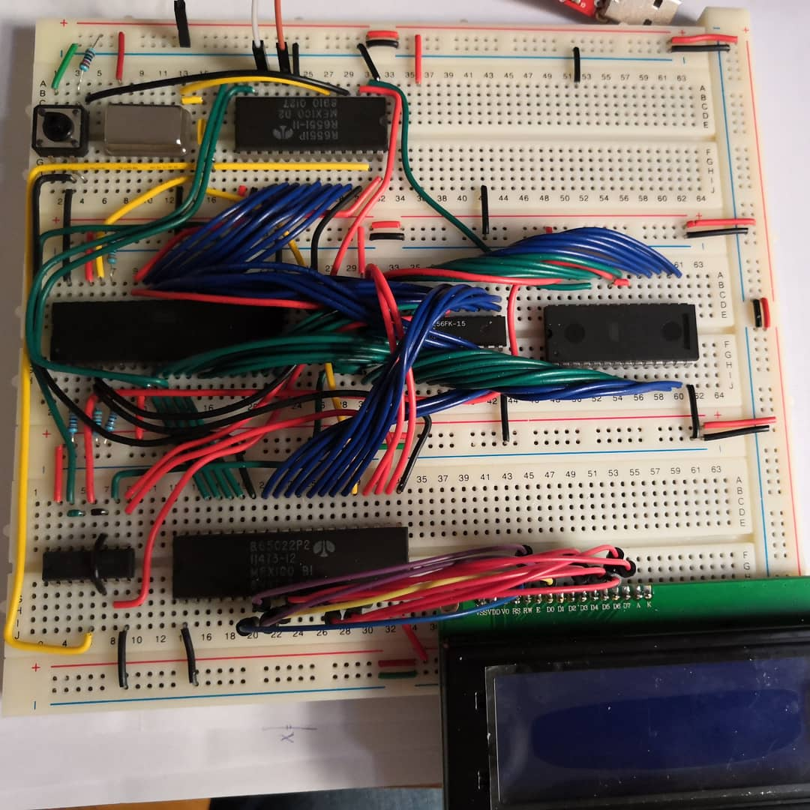
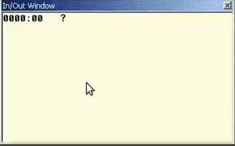
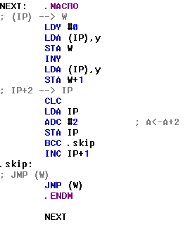
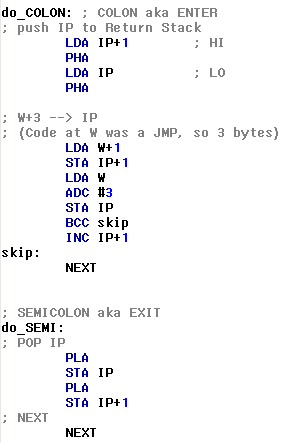
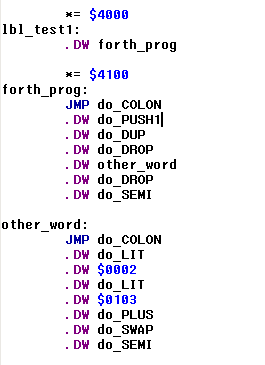

# Homebrew 6502 SBC

- [Homebrew 6502 SBC](#homebrew-6502-sbc)
- [Introduction](#introduction)
- [Hardware](#hardware)
  - [Schematics](#schematics)
  - [Memory Map](#memory-map)
- [Software](#software)
  - [Monitor](#monitor)
  - [FORTH](#forth)
- [Credits](#credits)
- [Datasheets](#datasheets)
- [References](#references)

# Introduction

This project is about building a single board 65c02 computer.

It's built around a WDC 65C02s CPU driven by a 1.8432MHz oscillator clock, with 32KB of SRAM (only 16K used), 32K of ROM, a 65c22 VIA interface, a 6551 ACIA serial interface, and an 20x4 LCD screen.

The ROM is programmed using my self-made [EEPROM programmer](programmer/README.md).

# Hardware

## Schematics

See [this file](sbc/schematics/6502.pdf).

## Memory Map

TBD

# Software

## Monitor

At the moment the monitor is very rudimentary, but it serves its purpose.

Monitor will show content at ADDR. You can type:
- a new ADDR (4 char, hex): this will set ADDR to the new value, and display the content. For ex. `04F0`
- a value (2 char, hex): this will store the value at ADDR. For ex. `FB`
- `'` followed by a char: store the char at ADDR. For ex. `'A`
- `j` restore registers to saved values and jump to ADDR
- `c` continue (after a BRK). restore registers to saved values, set ADDR to saved PC (after BRK) and jump to ADDR

Registers manipulation (saved values):
- `aXX` : store XX (hex) in A
- `xXX` : store XX (hex) in X
- `yXX` : store XX (hex) in Y
- `sXX` : store XX (hex) in S
- `pXX` : store XX (hex) in P
- `r`   : print registers value

Early demo of the Monitor in Kowalksi 6502 simulator:

## FORTH

I'm trying to develop a FORTH kernel for my Homebrew 6502.

It's very early, but for now it seems to work in Kowalksi 6502 simulator.

### NEXT routine (the interpreter)

### ENTER/EXIT routines

### A sample FORTH program

This is a sample (and somewhat absurd) FORTH program, at the moment it is hardcoded (no compiler). It is made of two colon definitions which several primitive words as well as another colon defined word.

# Credits

Here are some awesome projects. From some of them I have taken inspiration, from others I have copied lines of code.

- [Build a 6502 computer | Ben Eater](https://eater.net/6502): This is definitely what started all this.

# Datasheets

- [W65C02S 8–bit Microprocessor](datasheets/w65c02s.pdf)
- [W65C22S Versatile Interface Adapter (VIA)](datasheets/wdc_W65C22S_datasheet_mar_2004.pdf)
- [HD44780U LCD Controller/Driver](datasheets/HD44780.pdf)
- [UM61256FK-15 32K x 8 Bit SRAM](datasheets/UM61256FK-15_SRAM.pdf)
- [AT28C256 32K x8 Paged Parallel EEPROM](datasheets/AT28C256.pdf)
- [HD44780U LCD Controller/Driver](datasheets/HD44780.pdf)
- [SN74HC00 Quadruple 2-Input NAND Gates](datasheets/SN74HC00.pdf)
- [SN74HC138 3-Line To 8-Line Decoders/Demultiplexers](datasheets/SN74HC138.pdf)
- [SN74HC245 Octal Bus Transceivers With 3-State Outputs](datasheets/SN74HC245.pdf)

# References

- [ca65 Users Guide](https://cc65.github.io/doc/ca65.html)
- [6502 Instruction Set](https://www.masswerk.at/6502/6502_instruction_set.html)
- FORTH:
  - [Moving Forth: Part 1](https://www.bradrodriguez.com/papers/moving1.htm)
  - [Bitwise, Day 35: Implementing Forth - YouTube](https://www.youtube.com/watch?v=rlayTh3sjiw)