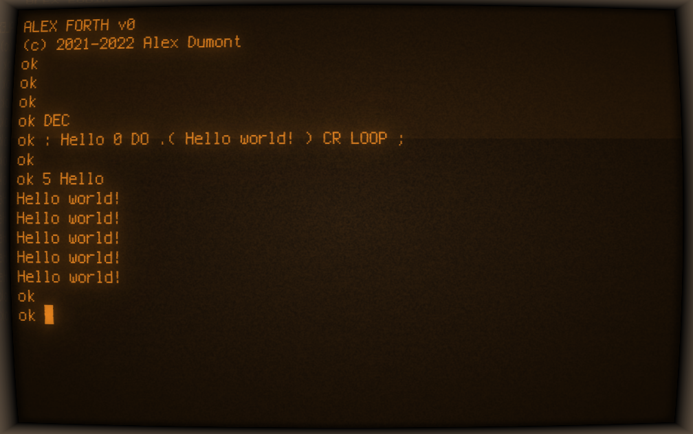

# Homebrew 6502 SBC

- [Homebrew 6502 SBC](#homebrew-6502-sbc)
- [Introduction](#introduction)
- [Hardware](#hardware)
  - [Schematics](#schematics)
  - [Memory Map](#memory-map)
- [Software](#software)
  - [Monitor](#monitor)
  - [FORTH](#forth)
- [Datasheets](#datasheets)
- [References](#references)

# Introduction

This project is about building a single board 65c02 computer.

It's powered by a WDC 65C02s CPU driven by a 1.8432MHz oscillator clock, with 32KB of SRAM (only 16K used), 32K of ROM, a 65c22 VIA interface, a 6551 ACIA serial interface, and an 20x4 LCD screen.

The ROM is programmed using my self-made [EEPROM programmer](programmer/README.md).

# Hardware

## Schematics

[Schematics in PDF format](sbc/schematics/easyeda/Schematic_6502.pdf).

## Memory Map

The address decoding logic is following the one described by Garth Wilson in his [6502 Primer, Address decoding](https://wilsonminesco.com/6502primer/addr_decoding.html) page. The corresponding schematics is:

(picture by Garth Wilson from his 6502 Primer)

| Address       | Component  |
| ------------- | ---------- |
| `$0000-$3FFF` | RAM (16KB) |
| `$4200-$4203` | ACIA       |
| `$6000-$600F` | VIA        |
| `$8000-$FFFF` | ROM (32KB) |

# Software

## Monitor

At the moment the monitor is very rudimentary, but it serves its purpose.

Monitor will show content at ADDR. You can type:
- a new ADDR (4 char, hex): this will set ADDR to the new value, and display the content. For ex. `04F0`
- a value (2 char, hex): this will store the value at ADDR. For ex. `FB`
- `'` followed by a char: store the char at ADDR. For ex. `'A`
- `j` restore registers to saved values and jump to ADDR
- `c` continue (after a BRK). restore registers to saved values, set ADDR to saved PC (after BRK) and jump to ADDR

Registers manipulation (saved values):
- `aXX` : store XX (hex) in A
- `xXX` : store XX (hex) in X
- `yXX` : store XX (hex) in Y
- `sXX` : store XX (hex) in S
- `pXX` : store XX (hex) in P
- `r`   : print registers value

Early demo of the Monitor in Kowalksi 6502 simulator:

## FORTH

I have implemented my own FORTH kernel for this Homebrew 6502.

Read more here [hb6502/forth](https://github.com/adumont/hb6502/tree/main/forth#homebrew-6502-sbc---forth).

# Datasheets

- [W65C02S 8–bit Microprocessor](datasheets/w65c02s.pdf)
- [W65C22S Versatile Interface Adapter (VIA)](datasheets/wdc_W65C22S_datasheet_mar_2004.pdf)
- [HD44780U LCD Controller/Driver](datasheets/HD44780.pdf)
- [UM61256FK-15 32K x 8 Bit SRAM](datasheets/UM61256FK-15_SRAM.pdf)
- [AT28C256 32K x8 Paged Parallel EEPROM](datasheets/AT28C256.pdf)
- [HD44780U LCD Controller/Driver](datasheets/HD44780.pdf)
- [SN74HC00 Quadruple 2-Input NAND Gates](datasheets/SN74HC00.pdf)
- [SN74HC138 3-Line To 8-Line Decoders/Demultiplexers](datasheets/SN74HC138.pdf)
- [SN74HC245 Octal Bus Transceivers With 3-State Outputs](datasheets/SN74HC245.pdf)

# References

- [Build a 6502 computer | Ben Eater](https://eater.net/6502)
- [6502 PRIMER: Building your own 6502 computer](https://wilsonminesco.com/6502primer/)
  - [Address Decoding](https://wilsonminesco.com/6502primer/addr_decoding.html)
- [ca65 Users Guide](https://cc65.github.io/doc/ca65.html)
- [6502 Instruction Set](https://www.masswerk.at/6502/6502_instruction_set.html)