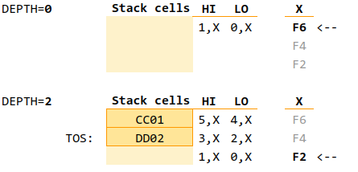
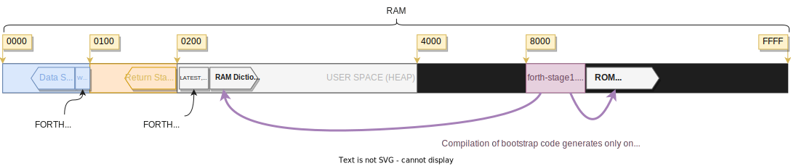
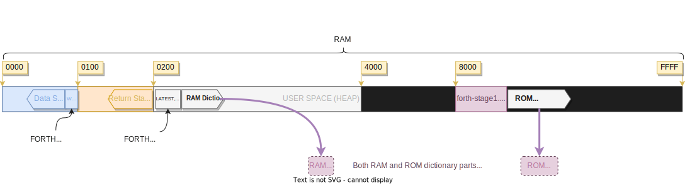
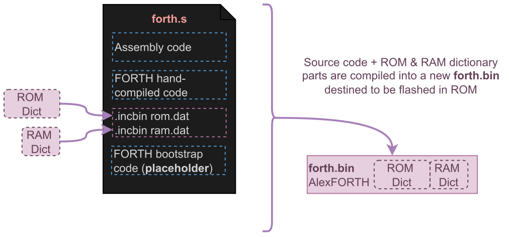
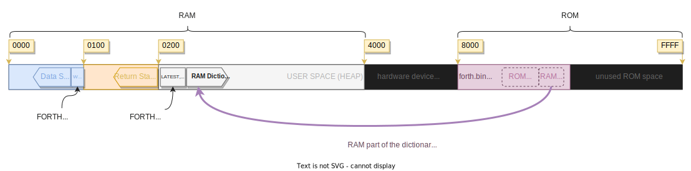

# Homebrew 6502 SBC - FORTH

- [Homebrew 6502 SBC - FORTH](#homebrew-6502-sbc---forth)
- [Introduction](#introduction)
- [Implementation notes](#implementation-notes)
	- [Direct Threaded Code](#direct-threaded-code)
	- [Stacks](#stacks)
	- [Anatomy of compiled words](#anatomy-of-compiled-words)
	- [Numbers and base](#numbers-and-base)
- [Two stages compilation](#two-stages-compilation)
	- [Source code organization](#source-code-organization)
	- [Two stages compilation process](#two-stages-compilation-process)
	- [Pros and cons](#pros-and-cons)
- [Try it live!](#try-it-live)
	- [Examples](#examples)
- [How to build](#how-to-build)
	- [Build for the hardware](#build-for-the-hardware)
	- [Build for py65 simulator](#build-for-py65-simulator)
	- [Step by step debugger](#step-by-step-debugger)
- [References](#references)

# Introduction

This page is about AlexForth, my own implementation of FORTH for my Homebrew 6502 SBC.

 *(screenshot taken in Cool Retro Term)*

To develop this FORTH I have started with Kowalsky 6502 simulator, as it helped me debugging the 6502 code step by step, while introspecting registers and ram. 

I've then maintained two paralel versions of the code:

- `forth00.asm` was the source initial source I worked on, suitable to run in the Kowalsky 6502 simulator, with no macro for the words header for example.
- Now AlexForth source code is divided into two files `forth.s` and `bootstrap.f`, see [Source code organization](#source-code-organization).

Note: `forth00.asm` source is old and not aligned any more with `forth.s`. I leave it here as it can be useful to run it in Kowalsky 6502 simulator.

# Implementation notes

## Direct Threaded Code

This implementation of FORTH follows a Direct Threaded Code (DTC) model.

There are two 16 bit registers defined in zero page that are fundamental to walk along the threaded code (see `NEXT`):
- IP: Next instruction pointer. (IP) -> W
- W: Address of the code to run. JMP (W)

### Entry point

At the beginning of our code, we'll find this instructions which initialize IP with the address of the first WORD of our FORTH program, and jumps to `NEXT`.

```
; Load the entry point of our main FORTH
; program and start execution (with JMP NEXT)
	; Place forth_prog ADDR into IP register
	LDA #<forth_prog
	STA IP
	LDA #>forth_prog
	STA IP+1

; Start FORTH
	BRA NEXT
```

Where forth_prog is a label. At this address we have our first hand-compiled FORTH code. 

Notice that this is the very beginning of our code (after a few initialization code)! We're already running FORTH code (although hand-compiled).

```
forth_prog:
; Print version string
	.ADDR do_LIT, VERS_STR
	.ADDR do_COUNT, do_TYPE
```

This FORTH code will print the version string on the output device.

### NEXT

```
NEXT:
; (IP) --> W
	LDA (IP)
	STA W
	LDY #1
	LDA (IP),y
	STA W+1
; IP+2 --> IP
	CLC
	LDA IP
	ADC #2		; A<-A+2
	STA IP
	BCC @skip
	INC IP+1
@skip:
	JMP (W)
```

First `NEXT` takes the address pointed to by IP and put it in W.

It then advances IP by 2.

Finally, `NEXT` jumps to the address stored at W.

### COLON

```
h_COLON:
	.DW $0000
	.STR "DOCOL"
do_COLON: ; COLON aka ENTER
; push IP to Return Stack
	LDA IP+1	; HI
	PHA
	LDA IP		; LO
	PHA

; W+3 --> IP 
; (Code at W was a JMP, so 3 bytes)
	CLC
	LDA W
	ADC #3
	STA IP
	LDA W+1
	ADC #0
	STA IP+1
	JMP NEXT
```

`COLON` is the assembler code run upon entering any colon word.

- It will first push IP (address of the next word to run) to the Return Stack, so that we come back to it upon finishing to run the current word (see `SEMI`).

- It will advance W by 3 (skipping over the JMP instruction) and store it in IP, so that IP will then point to the address of the code of the next word (next word in the definition of this colon word being run).

- It finally jumps to `NEXT`

### SEMI

```
; SEMICOLON aka EXIT
h_SEMI:
	.DW h_COLON
	.STR "SEMI"
do_SEMI:
; POP IP from Return Stack
	PLA
	STA IP
	PLA
	STA IP+1
; JMP NEXT
	JMP NEXT
```

The last word in a colon definition is `SEMI` (`;`).

`SEMI` simply retrieves the address of the next word to run from the Return Stack and stores it in IP.

It then jumps to `NEXT`.

### Charts and images

To Do


## Stacks

### Data Stack

The *Data Stack* is build in Zero Page. It starts at the top of ZP (just below the FORTH registers W, IP, G1 and G2).

Accessing the Data Stack is easy using the index Zero Page addressing mode `ZP,X` as show on this diagram:



*Note*: The 6502 `X` register is used as the Data Stack pointer through all assembly code. If an assembly routine needs to use the `X` register, it must save it and restore it before returning (see for example the code for `R@`).

At boot time, the stack is empty. `X` points to the next cell on the stack.

Pushing a two byte cell on the stack is done my storing the *LO byte* at 0,X, and the *HI byte* at 1,X, and then decrementing X twice (`DEX`).

At any time one can access the TOS cell's *LO byte* at 2,X, and its *HI byte* at 3,X.

Dropping the TOS cell is simply done by incrementing `X` (`INX`) twice.

### Return Stack

The *Return Stack* is implemented on the 6502 stack (in page 01: $0100-$1ff), values are pushed/popped using the stack manipulations mnemonics (PHA, PLA,...).

As seen above, `COLON` pushes `IP` to the *Return Stack*, and `SEMI` pops it back into `IP` upong exiting the word.

### Local Variables Stack

Local variables are implemented using the approach of a third stack and fixed named local variables (x,y,z and t) for simplicity. Only 4 local variable have names, but more can be easily added.

- `LOCALS ( n -- )` will allocate a new stack frame on the Local Variable Stack. It takes the number of variables to allocate.
- `-LOCALS ( -- )` will remove the last allocated Local Variable stack frame.
- Set the local variables `( n -- )` using: `x!`, `y!`, `z!` and `t!`.
- Get the local variables `( -- n)` using: `x`, `y`, `z` and `t`.

Example word:

```
: swap			\ redefines SWAP with locals
  2 LOCALS		\ allocate 2 local variables
  y! x!			\ set y and x
  y x			\ restore y and x
  -LOCALS		\ remove the local variables
;
```

Which would produce the desired effect:

```
1 2 .S
0001 0002 

swap .S
0002 0001 
```

The stack pointer is defined as a FORTH variable called BP (base pointer).

Each call to `LOCALS` will create a new stack frame made of:
- pointer to the previous frame (previous value of BP)
- 1 cell per local variable

Implementation is 100% made in FORTH in the bootstrap code (see [hb6502@d76eaec](https://github.com/adumont/hb6502/commit/d76eaecc93ba2ea9235a7a79540a4dca0a3a6cad#diff-a0410665e1d6f9fcce04ae1870c02c3718b27058590c6f8c40d5284e46e2b626R1967)). If not used, the whole block can be commented out to save RAM.

## Anatomy of compiled words

See [this page](doc/anatomy.md) to see the anatomy different examples of compiled words.

## Numbers and base

You can change the base using `DEC`, `BIN`, `OCT` or `HEX`. By default, system starts in `HEX`.

The current base is stored in `BASE` (you can retrieve it using `BASE @`).

While in any BASE, you can always input numbers using a prefix to force a different base:
- `#` decimal, for example: `#12`
- `$` hexadecimal, for example:  `$FF`
- `o` octal, for example: `o1017`
- `%` binary, for example: `%101100`

Notice: only base 2, 8, 10 and 16 are supported.

# Two stages compilation

## Source code organization

AlexFORTH source code is split into two files, to facilitate a two stages compilation process:
- `forth.s`: main source, written mostly in 65C02 assembly language. It's compiled using ca65. It contains:
  - the source for the inner interpreter: `NEXT`, `COLON` (aka ENTER) and `SEMI` (aka EXIT)
  - assembly code for primitive words, like `0`, `DUP`, `SWAP`...
  - many secondary words are also defined in this source file, in hand-compiled FORTH form, like `;`, `ALLOT`...
  - the outter interpreter also hand-compiled in this file (see `forth_prog` label)
  - macro to create words header and linking/threading the dictionary, like `CString`, `defword` and `noheader`
  - defines to tweak the compilation process and allow a different behaviour wether we are in Stage 1 (building for the host) or Stage 2 (building for the end target)
- `bootstrap.f`: this file written in AlexFORTH contains the definition of more words that will be added to AlexFORTH core dictionary during compilation. This file allow for extending AlexFORTH by simply writing FORTH code.

## Two stages compilation process

AlexForth compilation is a two-stages compilation:
- In **Stage 1**:
  - The `forth.s` source code is compiled (`forth-stage1.bin`) for being run in an 6502 emulator on the host system (`xcompiler`).
  - `xcompiler` will run `forth-stage1.bin` on the host computer, in a 6502 emulator, and interpret and compile the bootstrap code, generating the dictionary in a memory space that corresponds to the target's ROM memory space (exception for any variables defined in bootstrap code, will go in a memory space that corresponds to the target's RAM memory space)

  - Once reaching the end of the bootstrap code compilation, `xcompiler` will extracts ROM's and RAM's dictionary as binary images.

- In **Stage 2**:
  - The `forth.s` file is compiled again, but this time embedding the RAM and ROM binary images extracted in Stage 1, thus generating a single `forth-hw.bin` binary image, suitable to be flashed in the target 65C02 hardware computer (or run in a target 65C02 emulator

  <center></center>

  - At runtime, the RAM binary image (containing variables) is copied into RAM:



[This document](https://raw.githubusercontent.com/adumont/hb6502/main/forth/doc/AlexFORTH_two_stages_compilation.pdf) contains some diagrams further illustrating the 2 stages compilation process.

Note: I sometimes refer to  this two stages compilation process as "cross-compilation" (hence the name `xcompiler`) but I'm not sure that's the right term. I also wonder if that should be rather named "meta-compilation" instead. Feel free to give me feedback on this.
It make sense to me to call this cross-compilation because the final target image is generated on a host computer (with a different architecture) using the `xcompiler`. It only happens to be a convenience that `xcompiler` actually runs the same code to interpret and compile itself... making it a self/endocompilation, the result being a binary image suitable to run on the target system.

## Pros and cons

This two stages compilation process enables:
- Almost-instant boot time, as there's no bootstrap code compilation happening every boot,
- Reducing the ROM footprint (compiled code is smaller than FORTH code)
- Reducing RAM footprint freeing RAM for user application (because all the system dictionary is in ROM)

The cost of the two stages compilation is a slower compilation time, as it needs to compile the bootstrap code to generate the rom image, each time there's any change to the bootstrap code (As I build using make this is automated.)

# Try it live!

You can use my Forth here [AlexForth in Replit](https://replit.com/@AlexandreDumon1/Alex-Forth) (it might not be the latest version).  

Notice:
- It's not ANS Forth, but my own incomplete and free implementation
- At this moment, it only supports integers Math
- Words are case sensitive! (all default words defined in CAPS, for example SWAP, DUP, DROP... )
- There is NO stack underflow/overflow checking at all. So you can easily mess everything :). Don't worry. Just reset and start again!
- Android user, on mobile I find some keyboard mess with Repl.it. Try disabling all keyboard predictions and auto-typing features

## Examples

Here are some very simple examples. For more advanced example and tecniques, see [examples.md](doc/examples.md).

### Hello world

```
.( Hello World!) CR
```

This should output this on a new line:

```
Hello world!
```

### Simple Arithmetics

```
1 2 +
```

This should output:

```
0003
```

### Variables

- Create variable Z:

```
VARIABLE Z
```

- Store value `AA01` into variable Z:

```
AA01
Z ! 
```

- Get value of variable Z and print it:

```
Z @ .
AA01 
```

### Memory Manipulation

Example 1: Read the reset vector:

```
FFFC @ .
```

This should output:

```
8000
```

### Define new words

Let's define the word `+!`. It takes a value and a variable name, and adds the value to the variable's value (and stores it back into the variable).

Let's enter:
```
: +! DUP @ ROT + SWAP ! ;
```
Now our FORTH knows this new word `+!`, so let's try it:

```
1 Z +!
Z @ .
```

Assuming `Z` was still at the value `AA01`, this should output:

```
AA02
```
### Fibonacci Numbers

This will compute Fib(n) where n is a single cell integer.

```
: next-fib   DUP ROT + ;

: fib DUP IF  0 1 ROT 1 DO next-fib LOOP SWAP  ELSE 0 THEN DROP ;

DEC

9 fib .
34

24 fib .
46368
```

Notice how we do not need to use recursion!

24th Fibonacci number is the biggest we can compute with 16bit integers.

### Fibonacci Sequence (Double Version)

This version will compute Fib(N) using Doubles (2 cells integers). It is capable of computing Fib(N) for N up to 46 ($2E). After that it will overflow. 

```
: 2SWAP >R -ROT R> -ROT ;
: 2DUP OVER OVER ;
: 2ROT >R >R 2SWAP R> R> 2SWAP ;

: Dnext-fib 2DUP 2ROT D+ ;

: fib-seq 1+ 0 DUP DUP . D. CRLF
  DUP IF 0 0 0 1 0 2ROT DROP 1 DO 
  Dnext-fib 2DUP I . D. CRLF LOOP 2SWAP ELSE 
  0 0 THEN DROP DROP ;
```

This version will print all the Fibonacci numbers from 0 to N. Remember the Unsigned Double integers are in hexadecimal.

Now run for example `2E fib-seq`, to print the Fibonacci numbers from Fib(0) up to Fib(46):

```
2E fib-seq
0000 00000000
0001 00000001
0002 00000002
0003 00000003
0004 00000005
0005 00000008
0006 0000000D
0007 00000015
...
002C 43A53F82
002D 6D73E55F
002E B11924E1
```

### Cellular Automaton

Code here: [Cellular Automaton in (my) FORTH](https://gist.github.com/adumont/5efc97e5603ceb1d75d79cfcbfc91bd7)

# How to build

## Build for the hardware

Instructions to build and flash the forth.bin for the Homebrew (hardware) version:

- `make hw` will build the `forth-hw.bin` image for the target 6502 hardware computer
- `make flash` will flash the `forth-hw.bin` to the AT28C256 eeprom using minipro

You can then use `minicom -D /dev/ttyUSB0 -b 115200` or any other serial terminal program to connect to the computer (using an FTDI USP adapter).

Minicom config file (~/.minirc.dfl):

```
pu port             /dev/ttyUSB0
pu baudrate         115200
pu rtscts           No 
```

## Build for py65 simulator

Instructions to build and run the forth.bin in the py65 simulator:

- `make emu` will build the `forth-emu.bin` image suitable for the 6502 emulator
- `make` or `make run` will run the `forth-emu.bin` in the emulator
- `make debug` will run the `forth-emu.bin` in the step by step debugger

### Options of the emulator

The py65forth emulator will load the forth-emu.bin rom by default. It's possible to load a different rom using `-r`, also to a different base address using `-a`.

The user can also specify a FORTH source file to load at boot time using the `-l` option.

```
usage: py65forth.py [-h] [-r ROM] [-a ADDR] [-l LOAD]

optional arguments:
  -h, --help            show this help message and exit
  -r ROM, --rom ROM     binary rom file
  -a ADDR, --addr ADDR  address to load to
  -l LOAD, --load LOAD  forth program to load
```

## Step by step debugger

```
$ ./debugger.py -h
usage: debugger.py [-h] [-r ROM] [-a ADDR] [-l LOGFILE] [-s SYMBOLS]
                   [-b BREAKPOINT]

optional arguments:
  -h, --help            show this help message and exit
  -r ROM, --rom ROM     binary rom file
  -a ADDR, --addr ADDR  address to load to
  -l LOGFILE, --logfile LOGFILE
                        filename of log
  -s SYMBOLS, --symbols SYMBOLS
                        symbols file
  -b BREAKPOINT, --breakpoint BREAKPOINT
                        set breakpoint (symbol)
```

Keys in debugger:
- END key will start/resume the continuous execution
- PAGE-UP: will active the debug pane, showing some more info.
- PAGE-DOWN will run instruction by instruction

# References

This are the books, articles, papers or videos I've read/watched and that have helped me understand FORTH and make progress in this project.

- [Moving Forth: Part 1](https://www.bradrodriguez.com/papers/moving1.htm): explains the Direct and Indirect Threading Code models
- [Threaded Interpretive Languages Their Design And Implementation](https://archive.org/details/R.G.LoeligerThreadedInterpretiveLanguagesTheirDesignAndImplementationByteBooks1981), R. G. Loeliger, Byte Books (1981)
- [Bitwise](https://github.com/pervognsen/bitwise): an educational project where we create the software/hardware stack for a computer from scratch
  - Days 35 to 39 are about Implementing Forth: [Day 35 - Part 1](https://www.youtube.com/watch?v=rlayTh3sjiw), [Day 36 - Part 2](https://www.youtube.com/watch?v=SPErnyotJrk), [Day 37 - Part 3](https://www.youtube.com/watch?v=TA8blMaNqxY), [Day 38 - Part 4.1](https://www.youtube.com/watch?v=asW2hkGnsyM&t=6977s), [Day 38 - Part 4.2](https://www.youtube.com/watch?v=ceTRcHsXRzQ), [Day 39 - Part 5.1](https://www.youtube.com/watch?v=4Uy1Mq8p72w), [Day 39 - Part 5.2](https://www.youtube.com/watch?v=O6t14AGPO50)
- [6502 stacks treatise index](https://wilsonminesco.com/stacks/index.html)
- [Systems Guide to figForth](http://forth.org/OffeteStore/1010_SystemsGuideToFigForth.pdf)
- [Forth 2012](http://lars.nocrew.org/forth2012/) Forth 200x Standardisation Committee

Some more articles, routines or listings that have also been useful:
- [JonesForth](https://github.com/nornagon/jonesforth/): A tutorial-like implementation of FORTH for the x86 with a lot of inline documentation.
- [fig-FORTH 6502 assembly source listing](https://ksquiggle.neocities.org/ff6502.htm)
- [forthkit/eforth.forth](https://github.com/tehologist/forthkit/blob/master/eforth.forth)
- [6502.org: Source: Division (32-bit)](http://www.6502.org/source/integers/ummodfix/ummodfix.htm)
- [6502.org: Source: Multiply & Divide](http://www.6502.org/source/integers/32muldiv.htm)
- [Stack Frames and Local Variables](http://soton.mpeforth.com/flag/jfar/vol3/no1/article3.pdf) by George B. Lyons, in The Journal of Forth Application and Research Volume 3, Number 1, 1985
