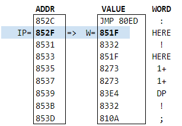

# Homebrew 6502 SBC - FORTH

- [Homebrew 6502 SBC - FORTH](#homebrew-6502-sbc---forth)
- [Introduction](#introduction)
- [Try it!](#try-it)
  - [Examples](#examples)
- [Implementation notes](#implementation-notes)
- [References](#references)

# Introduction

This page is about my own implementation of FORTH for my Homebrew 6502 SBC.


# Try it!

You can use my Forth here [Alex Forth in Replit](https://replit.com/@AlexandreDumon1/Alex-Forth) (it might not be the latest version).  

Notice:
- It doesn't print {OK}
- It's not ANS Forth, but my own incomplete and free implementation.
- At this moment, it only supports integers
- The base for all numbers is hexadecimal
- Comments \ and ( ) are not supported
- Words are case sensitive! (all default words defined in CAPS, for example SWAP, DUP, DROP... )
- There is NO stack underflow/overflow checking at all. So you can easily mess everything :). Don't worry. Just reset and start again!
- Android user, on mobile I find some keyboard mess with Repl.it. Try disabling all keyboard predictions and auto-typing features.

## Examples

### Hello world

```
S( Hello World!) TYPE CRLF
```

This should output this on a new line:

```
Hello world!
```

### Simple Arithmetics

```
1 2 +
```

This should output:

```
0003
```

### Variables

- Create variable Z:

```
VARIABLE Z
```

- Store value `AA01` into variable Z:

```
AA01
Z ! 
```

- Get value of variable Z and print it:

```
Z @ .
AA01 
```

### Memory Manipulation

Example 1: Read the reset vector:

```
FFFC @ .
```

This should output:

```
8000
```

### Define new words

Let's define the word `+!`. It takes a value and a variable name, and adds the value to the variable's value (and stores it back into the variable).

Let's enter:
```
: +! DUP @ ROT + SWAP ! ;
```
Now our FORTH knows this new word `+!`, so let's try it:

```
1 Z +!
Z @ .
```

Assuming `Z` was still at the value `AA01`, this should output:

```
AA02
```
### Fibonacci Numbers

This will compute Fib(n) where n is a single cell integer.

```
: next-fib   DUP ROT + ;

: fib DUP IF  0 1 ROT 1 DO next-fib LOOP SWAP  ELSE 0 THEN DROP ;

9 fib .
22
```

Remember the base is 16, so all numbers are hexadecimal. Indeed Fib(9)=$22=34.

Notice how we do not need to use recursion!

### Fibonacci Sequence (Double Version)

This version will compute Fib(N) using Doubles (2 cells integers). It is capable of computing Fib(N) for N up to 46 ($2E). After that it will overflow. 

```
: 2SWAP >R -ROT R> -ROT ;
: 2DUP OVER OVER ;
: 2ROT >R >R 2SWAP R> R> 2SWAP ;

: Dnext-fib 2DUP 2ROT D+ ;

: fib-seq 1+ 0 DUP DUP . D. CRLF
  DUP IF 0 0 0 1 0 2ROT DROP 1 DO 
  Dnext-fib 2DUP I . D. CRLF LOOP 2SWAP ELSE 
  0 0 THEN DROP DROP ;
```

This version will print all the Fibonacci numbers from 0 to N. Remember the Unsigned Double integers are in hexadecimal.

Now run for example `2E fib-seq`, to print the Fibonacci numbers from Fib(0) up to Fib(46):

```
2E fib-seq
0000 00000000
0001 00000001
0002 00000002
0003 00000003
0004 00000005
0005 00000008
0006 0000000D
0007 00000015
...
002C 43A53F82
002D 6D73E55F
002E B11924E1
```

# Implementation notes




# References

This are the books, articles, papers or videos I've read/watched and that have helped me understand FORTH and make progress in this project.

- [Moving Forth: Part 1](https://www.bradrodriguez.com/papers/moving1.htm): explains the Direct and Indirect Threading Code models
- [Threaded Interpretive Languages Their Design And Implementation](https://archive.org/details/R.G.LoeligerThreadedInterpretiveLanguagesTheirDesignAndImplementationByteBooks1981), R. G. Loeliger, Byte Books (1981)
- [Bitwise](https://github.com/pervognsen/bitwise): an educational project where we create the software/hardware stack for a computer from scratch
  - Days 35 to 39 are about Implementing Forth: [Day 35 - Part 1](https://www.youtube.com/watch?v=rlayTh3sjiw), [Day 36 - Part 2](https://www.youtube.com/watch?v=SPErnyotJrk), [Day 37 - Part 3](https://www.youtube.com/watch?v=TA8blMaNqxY), [Day 38 - Part 4.1](https://www.youtube.com/watch?v=asW2hkGnsyM&t=6977s), [Day 38 - Part 4.2](https://www.youtube.com/watch?v=ceTRcHsXRzQ), [Day 39 - Part 5.1](https://www.youtube.com/watch?v=4Uy1Mq8p72w), [Day 39 - Part 5.2](https://www.youtube.com/watch?v=O6t14AGPO50)
- [6502 stacks treatise index](https://wilsonminesco.com/stacks/index.html)
- [Systems Guide to figForth](http://forth.org/OffeteStore/1010_SystemsGuideToFigForth.pdf)

Some more articles, routines or listings that have also been useful:
- [JonesForth](https://github.com/nornagon/jonesforth/): A tutorial-like implementation of FORTH for the x86 with a lot of inline documentation.
- [fig-FORTH 6502 assembly source listing](https://ksquiggle.neocities.org/ff6502.htm)
- [forthkit/eforth.forth](https://github.com/tehologist/forthkit/blob/master/eforth.forth)
- [6502.org: Source: Division (32-bit)](http://www.6502.org/source/integers/ummodfix/ummodfix.htm)
- [6502.org: Source: Multiply & Divide](http://www.6502.org/source/integers/32muldiv.htm)