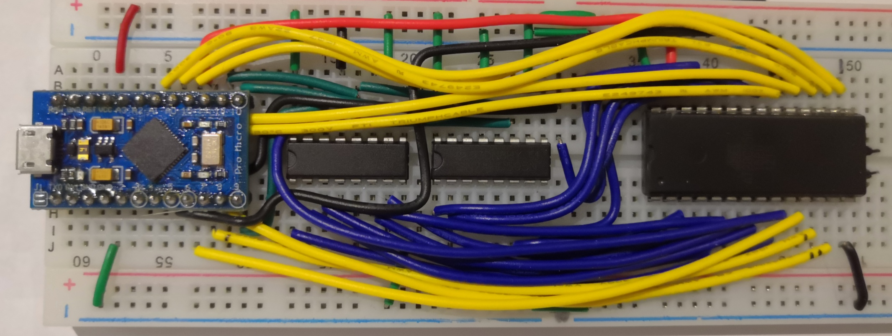

# Breadboard EEPROM Programmer

- [Breadboard EEPROM Programmer](#breadboard-eeprom-programmer)
- [Introduction](#introduction)
- [Schematics](#schematics)
- [How to use](#how-to-use)
  - [Command line interface](#command-line-interface)
- [Credits](#credits)
- [Datasheets](#datasheets)
- [References](#references)



# Introduction

This subproject is an EEPROM Programmer on a breadboard using:
- a Sparkfun Arduino Pro Micro
- two SN74HC595 Serial-In Parallel-Out (SIPO) Shift Registers, to minimize the pin needed on the Arduino.
- a AT28C256 32K x8 Paged Parallel EEPROM

# Schematics


# How to use

## Command line interface

Use `./eeprom.py` as a command line interface:

```
usage: eeprom.py [-h] [-p PORT] {flash,save,dump,erase} ...

EEPROM Programmer CLI

positional arguments:
  {flash,save,dump,erase}
    flash               Flash a binary file to EEPROM
    save                Save EEPROM to binary file
    dump                Dump EEPROM as text (hex/ascii)
    erase               Erase EEPROM

optional arguments:
  -h, --help            show this help message and exit
  -p PORT, --port PORT  USB port to use

Written by @adumont
```

### Dump 256 byte pages as text (hexa/ascii)

```
usage: eeprom.py dump [-h] [-a ADDR] [-n PAGES] [-o OFFSET]

optional arguments:
  -h, --help            show this help message and exit
  -a ADDR, --addr ADDR  Address (hexadecimal), default: 0000
  -n PAGES, --pages PAGES
                        Number of 256B pages to dump (decimal)
  -o OFFSET, --offset OFFSET
                        Offset to show addresses (hexadecimal), default: 8000
```

`./eeprom.py dump` will dump `PAGES` pages of 256 bytes starting at address `ADDR` (in hex). If `ADDR` isn't a multiple of 256, it will dump the 256 bytes page aligned around `ADDR`. If `offset` is specified, the addresses showned will be offset by `offset` (in hex).

```
$ ./eeprom.py dump
Connected to programmer on port: /dev/ttyACM0

00008000: 58d8 a9ff 8d03 60a9 aa85 00a9 ffa5 008d  X.....`.........
00008010: 0160 4c12 8040 daba 48e8 e8bd 0001 2910  .`L..@..H.....).
00008020: d003 68fa 404c 2580 a900 8508 a980 8509  ..h.@L%.........
00008030: a900 850a a902 850b a2ff a9ff 8510 a000  ................
00008040: e8f0 0db1 0891 0ac8 d0f6 e609 e60b d0f0  ................
00008050: e610 d0ef 6000 0000 0000 0000 0000 0000  ....`...........
[...]
```
### Flash a binary file to EEPROM

```
usage: eeprom.py flash [-h] [-a ADDR] file

positional arguments:
  file                  File to write to EEPROM

optional arguments:
  -h, --help            show this help message and exit
  -a ADDR, --addr ADDR  Address (hexadecimal), default: 0000
```

`./eeprom.py flash` will flash the file FILE at address ADDR. It takes about 13s to flash 32KB.

### Save EEPROM content to a binary file

```
usage: eeprom.py save [-h] [-a ADDR] [-l LEN] file

positional arguments:
  file                  File to save as

optional arguments:
  -h, --help            show this help message and exit
  -a ADDR, --addr ADDR  Address (hexadecimal), default: 0000
  -l LEN, --len LEN     Length (bytes, decimal)
```

`./eeprom.py save` will save LEN bytes (dec) from EEPROM starting at address ADDR (hex) to file FILE. It takes about 5.5s to download 16KB.

### Erase EEPROM

```
usage: eeprom.py erase [-h] [-f FILL]

optional arguments:
  -h, --help            show this help message and exit
  -f FILL, --fill FILL  Fill byte (hexadecimal), default: ff
```

`./eeprom.py erase` will write FF (hex) to all the EEPROM. It takes about 13s to erase 32KB.

# Credits

Here are some awesome projects from which I have taken inspiration and sometimes also some code as a starting point:

- [Build an Arduino EEPROM programmer](https://www.youtube.com/watch?v=K88pgWhEb1M) by Ben Eaters
  - [Source code](https://github.com/beneater/eeprom-programmer#arduino-eeprom-programmer)
- [mkeller0815/MEEPROMMER: EEPROM / EPROM programmer based on Arduino hardware](https://github.com/mkeller0815/MEEPROMMER/)
- [TomNisbet/TommyPROM: Simple Arduino-based EEPROM programmer](https://github.com/TomNisbet/TommyPROM)

# Datasheets

- [SNx4HC595 8-Bit Shift Registers With 3-State Output Registers](../datasheets/SN74HC595.pdf)
- [AT28C256 32K x8 Paged Parallel EEPROM](../datasheets/AT28C256.pdf)

# References

- [Pro Micro & Fio V3 Hookup Guide - learn.sparkfun.com](https://learn.s  parkfun.com/tutorials/pro-micro--fio-v3-hookup-guide/hardware-overview-pro-micro)
- [Arduino - ATmega 32U4 Pin Mapping](https://www.arduino.cc/en/Hacking/PinMapping32u4)
