# Breadboard EEPROM Programmer

- [Breadboard EEPROM Programmer](#breadboard-eeprom-programmer)
- [Introduction](#introduction)
- [How to use](#how-to-use)
  - [Command line interface](#command-line-interface)
- [Credits](#credits)
- [Datasheets](#datasheets)
- [References](#references)

# Introduction

This subproject is an EEPROM Programmer on a breadboard using:
- a Sparkfun Arduino Pro Micro
- two SN74HC595 Serial-In Parallel-Out (SIPO) Shift Registers, to minimize the pin needed on the Arduino.
- a AT28C256 32K x8 Paged Parallel EEPROM
# How to use

## Command line interface

Use `./eeprom.py` as a command line interface.

* Dump 256 byte pages as text:

`./eeprom.py -d/--dump [ADDR [n]]` will dump n pages of 256 bytes starting at address ADDR (in hex). If ADDR isn't a multiple of 256, it will dump around ADDR.

| Command                 | Meaning                                     |
| ----------------------- | ------------------------------------------- |
| `./eeprom.py -d`        | Dump page 0000                              |
| `./eeprom.py -d ADDR`   | Dump page at address ADDR (hex)             |
| `./eeprom.py -d ADDR 2` | Dump 2 pages starting at address ADDR (hex) |

* Erase EEPROM:

`./eeprom.py --erase [HH]` write HH (hex) to all the EEPROM. It takes about 13s to erase 32KB.

| Command                  | Meaning                       |
| ------------------------ | ----------------------------- |
| `./eeprom.py --erase`    | Fill the EEPROM with $FF      |
| `./eeprom.py --erase HH` | Fill the EEPROM with HH (hex) |

* Upload/Flash a binary file to EEPROM:

`./eeprom.py -p/--put ADDR FILE` upload and flash the file FILE at address ADDR. It takes about 7s to flash 16KB.

| Command                        | Meaning                                 |
| ------------------------------ | --------------------------------------- |
| `./eeprom.py --put 0 file.bin` | Flash `file.bin` to EEPROM at address 0 |

* Download a binary file from EEPROM:

`./eeprom.py -g/--get ADDR LEN FILE` LEN bytes (dec) from EEPROM startig at address ADDR (hex) to file FILE. It takes about 5.5s to download 16KB.

| Command                                  | Meaning                                                            |
| ---------------------------------------- | ------------------------------------------------------------------ |
| `./eeprom.py -g/--get 02F0 256 file.bin` | Get 256 bytes from EEPROM starting at $02F0 and save to `file.bin` |

# Credits

Here are some awesome projects from which I have taken inspiration and code:

- [Build an Arduino EEPROM programmer](https://www.youtube.com/watch?v=K88pgWhEb1M) by Ben Eaters
  - [Source code](https://github.com/beneater/eeprom-programmer#arduino-eeprom-programmer)

# Datasheets

- [SNx4HC595 8-Bit Shift Registers With 3-State Output Registers](../datasheets/SN74HC595.pdf)
- [AT28C256 32K x8 Paged Parallel EEPROM](../datasheets/AT28C256.pdf)

# References

- [Pro Micro & Fio V3 Hookup Guide - learn.sparkfun.com](https://learn.s  parkfun.com/tutorials/pro-micro--fio-v3-hookup-guide/hardware-overview-pro-micro)
- [Arduino - ATmega 32U4 Pin Mapping](https://www.arduino.cc/en/Hacking/PinMapping32u4)
